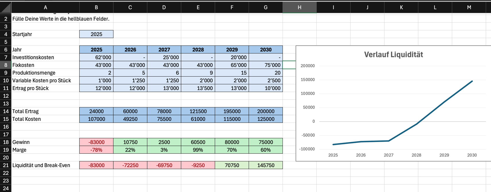

# Begründung der Kalkulation

> **Kontext:** Das Vorhaben startet **hobby-mässig** mit sehr geringer Stückzahl und begrenztem Aufwand. Mit der Zeit wächst die **Beteiligung** (mehr Teamzeit, besserer Prozess, grösseres Netzwerk), sodass Mengen, Preiseffizienz und Professionalität steigen.

## Annahmen (aus der Tabelle)
- **Startjahr:** 2025
- **Fixkosten:** 43’000 CHF/Jahr (2025–2028), **65’000** (2029), **75’000** (2030)  
  – Zusammensetzung: 12’000 CHF pro MA × 3 = 36’000 CHF + ca. 7’000 CHF Overhead (Miete/Tools/Versicherung/Buchhaltung/Hosting).
- **Variable Kosten pro Stück:** 1’000 (2025), 1’250 (2026/27), 2’000 (2028/29), **2’500 (2030)**
- **Preis pro Stück:** 12’000 (2025/26), 13’000 (2027), 13’500 (2028), 13’000 (2029), **10’000 (2030, Jubiläums-Sale)**
- **Menge (Stk):** 2, 5, 6, 9, 15, **20**
- **Investitionen:** **62’000 (2025)**, **25’000 (2027)**, **20’000 (2029)**

## Begründung der Entwicklung
- **Anfang (hobby-mässig):** Wenige Stücke (2–6), Fokus auf Setup, Lernkurve, erste Referenzen → konservative Umsätze.
- **Reife (ab 2028):** Standardisierte Abläufe, bessere Beschaffung, Qualitätssicherung → höhere Stückzahlen (9–20) und stabilere Marge.
- **Preisstrategie:** Zuerst marktschonend (12k), mit wachsendem Wert/Features Anhebung auf 13–13.5k, 2030 **Promo-Preis (10k)** für Reichweite/Lagerumschlag (Jubiläum).
- **Investitionen:** 2025 Grundausstattung; 2027 Tooling/Qualitätssprung; 2029 Kapazität/Redesign zur Skalierung.

## Warum höhere Kosten am Schluss?
- **Fixkosten 2029/2030 ↑:** Mehr Personal/Schichten (Support/QA/Montage), grössere Flächen & Infrastruktur, höhere Lizenz/Cloud-Gebühren, Marketing.
- **Variable Kosten 2030 ↑ (2’500/Stk):** Batch-Komplexität bei 20 Stk, zusätzliche End-of-Line-Tests, individualisierte Verpackung/Logistikspitzen, hochwertigerer Materialmix.

## Jahresergebnisse (aus der Tabelle)
- **Umsatz:** 24’000 • 60’000 • 78’000 • 121’500 • 195’000 • 200’000
- **Total Kosten:** 107’000 • 49’250 • 75’500 • 61’000 • 115’000 • 125’000
- **Gewinn:** **–83’000**, **+10’750**, **+2’500**, **+60’500**, **+80’000**, **+75’000**
- **Marge:** –78% • 22% • 3% • 99% • 70% • 60%
- **Kumulierte Liquidität:** –83’000 → –72’250 → –69’750 → **–9’250** → **+70’750** → **+145’750**

## Kennzahlen & Logik
- **Deckungsbeitrag/Stk (Beispiele):**  
  2025: ~11’000 • 2028: ~11’500 • 2030: ~8’000
- **Operativer Break-Even (ohne Invest):** 43’000 / ~11’000 ≈ **4 Stk/Jahr** → ab 2026 erreicht.
- **Kumulativer Break-Even:** **2028** (Liquidität springt ins Plus).

## Fazit
Das Modell zeigt einen **kapitalintensiven Start** im Hobby-Setting, gefolgt von **professioneller Skalierung** durch bessere Prozesse und gezielte Re-Investitionen. Trotz höherer Fix- und Stückkosten am Schluss bleibt die **Profitabilität** stark (70–60% Marge 2029/2030), die **Liquidität** baut sich nachhaltig auf.
